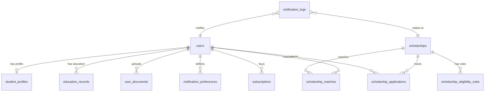

# Technical Audit: Existing Scholarship SaaS System

This document provides a comprehensive technical audit of the existing Scholarship SaaS codebase, preparing the architecture for the safe introduction of the **WACRM WhatsApp Notification System** in future steps.

---

## A. Database Schemas & Key Relationships

The application database schema consists of **35 tables** managed via SQL migrations. Below is an overview of the core entities and their relationships.



### Core Table Details

#### 1. `users`
Represents the base authentication entity.
*   **Key Fields**: `id` (INT Auto-Increment, Primary Key), `email` (VARCHAR 255, Unique Index), `password_hash` (VARCHAR 255), `role_name` (VARCHAR 50), `email_opt_in` (TINYINT 1), `whatsapp_opt_in` (TINYINT 1), `phone` (VARCHAR 50), `whatsapp_phone` (VARCHAR 50), `status` (VARCHAR 50).

#### 2. `student_profiles`
Stores student personal details linked to eligibility evaluations.
*   **Key Fields**: `user_id` (INT, Foreign Key referencing `users(id)`, Primary Key), `date_of_birth` (DATE), `nationality_id` (INT, Foreign Key referencing `countries(id)`), `gender` (VARCHAR 20), `gpa` (DECIMAL 4,2), `gpa_scale` (DECIMAL 4,2), `ielts_score` (DECIMAL 3,1), `toefl_score` (INT), `pte_score` (INT), `duolingo_score` (INT).

#### 3. `education_records`
Maintains academic history records.
*   **Key Fields**: `id` (INT Auto-Increment, PK), `user_id` (INT, Foreign Key referencing `users(id)`), `degree_level` (VARCHAR 50), `field_of_study` (VARCHAR 255), `grade_scale` (DECIMAL 4,2), `gpa` (DECIMAL 4,2), `is_current` (TINYINT 1), `start_date` (DATE), `end_date` (DATE).

#### 4. `scholarships`
Stores scholarship details.
*   **Key Fields**: `id` (INT Auto-Increment, PK), `title` (VARCHAR 255), `provider_name` (VARCHAR 255), `application_deadline` (DATE), `status` (VARCHAR 50: `draft`, `published`), `slug` (VARCHAR 255, Unique Index), `funding_type` (VARCHAR 50), `views_count` (INT), `country_id` (INT, FK).

#### 5. `scholarship_eligibility_rules`
Defines hard constraints evaluated by the matching engine.
*   **Key Fields**: `scholarship_id` (INT, Foreign Key referencing `scholarships(id)`, PK), `minimum_age` (INT), `maximum_age` (INT), `minimum_cgpa` (DECIMAL 4,2), `cgpa_scale` (DECIMAL 4,2), `minimum_percentage` (DECIMAL 5,2), `gender_requirement` (VARCHAR 20).

#### 6. `scholarship_matches`
Caches evaluation results between students and scholarships.
*   **Key Fields**: `user_id` (INT, FK, PK), `scholarship_id` (INT, FK, PK), `match_score` (INT), `eligibility_status` (VARCHAR 50: `ELIGIBLE`, `NOT_ELIGIBLE`, `INSUFFICIENT_DATA`), `recommendation_level` (VARCHAR 50), `calculated_at` (DATETIME).

#### 7. `notification_preferences`
Channels subscription configurations.
*   **Key Fields**: `user_id` (INT, FK), `notification_type` (VARCHAR 100), `email_enabled` (TINYINT 1), `whatsapp_enabled` (TINYINT 1).
*   **Constraints**: Unique composite index `uq_notif_pref_user_type(user_id, notification_type)`.

#### 8. `notification_logs`
Outbox queue and audit log for messages.
*   **Key Fields**: `id` (INT Auto-Increment, PK), `user_id` (INT, FK), `scholarship_id` (INT, FK, Nullable), `notification_type` (VARCHAR 100), `channel` (VARCHAR 50: `email`, `whatsapp`), `recipient` (VARCHAR 255), `subject` (VARCHAR 255, Nullable), `payload` (LONGTEXT), `idempotency_key` (VARCHAR 255, Unique Index `uq_notif_idempotency`), `status` (VARCHAR 50: `pending`, `processing`, `sent`, `failed`, `skipped`, `retrying`), `attempts` (INT), `error_message` (TEXT, Nullable), `available_at` (DATETIME), `sent_at` (DATETIME, Nullable), `created_at` (DATETIME), `updated_at` (DATETIME).

#### 9. `subscriptions`
Stores subscription records.
*   **Key Fields**: `id` (INT Auto-Increment, PK), `user_id` (INT, FK), `plan_id` (INT, FK), `status` (VARCHAR 50: `active`, `cancelled`, `expired`), `ends_at` (DATETIME).

---

## B. User Roles & Access Gating

Access gating is handled through session-based middleware and class permissions checking.

*   **Roles**: `visitor` (student user), `admin` (platform administrator), `employee` (staff), `partner` (referral partner).
*   **Route Protection**: Evaluated in controllers via `Auth::requireAuth()`, `Auth::requireRole()`, and `Auth::requirePermission()`.
*   **Feature Access Gates**: Checked dynamically via [`SubscriptionService::can($userId, $feature)`](file:///c:/laragon/www/scholarship/app/Services/SubscriptionService.php). 
    *   `whatsapp_alerts`: Granted only to paid subscriptions (e.g., `premium-monthly` plan).
    *   `deadline_alerts`: Gated by plan features.
    *   `premium_alerts`: Gated by plan features.

---

## C. Scholarship Lifecycle & Matching Engine

Scholarships progress through a basic lifecycle:

```
[Draft] ---> (All constraints met) ---> [Published]
```

### The Matching Engine
Implemented in [`ScholarshipMatchingService::matchUserAndScholarship()`](file:///c:/laragon/www/scholarship/app/Services/ScholarshipMatchingService.php).

*   **Hard Constraints (Eligibility status is disqualified if any fail)**:
    1.  **Nationality**: Must match the scholarship's list of eligible country IDs.
    2.  **Age**: Must fall within the min/max age rules.
    3.  **Degree Level**: The student's current degree level must match one of the scholarship's allowed degree levels.
    4.  **Field of Study**: The student's field of study must align with eligible fields.
    5.  **CGPA**: Student GPA normalized to the scholarship's scale must be greater than or equal to the minimum CGPA requirement.
    6.  **Percentage**: The student's grade percentage must meet the minimum requirement.
    7.  **Gender**: Must comply with any gender restrictions.
    8.  **Language Test**: Standard test scores (IELTS/TOEFL/PTE) must meet minimum rules if required.
    9.  **Deadline**: The application deadline must be in the future.
*   **Soft Preferences (Affect score calculations)**:
    *   Preferred destinations (countries).
    *   Preferred fields of study.
    *   Preferred funding types.
*   **Scoring Weights**:
    *   Eligibility matches: 70% of total score.
    *   Preferences matches: 30% of total score.
    *   *Note*: Capped to `0` if hard eligibility status is evaluated as `NOT_ELIGIBLE`.
*   **Recommendation Levels**:
    *   `HIGHLY_RECOMMENDED`: Score $\ge 85$.
    *   `RECOMMENDED`: Score $\ge 70$.
    *   `POSSIBLE_MATCH`: Score $\ge 50$.
    *   `LOW_MATCH`: Score $< 50$.
*   **Preloading & Scale Optimization**:
    Provides full bulk evaluation features, pre-fetching matching profiles and scholarship variables to run matching over thousands of permutations without N+1 query overhead.

---

## D. Notification Dispatch & Logging Outbox

The notification dispatch layer uses an outbox queue design.

1.  **Enqueue**: Notifications are generated and enqueued to `notification_logs` using [`NotificationQueueService::enqueue()`](file:///c:/laragon/www/scholarship/app/Services/NotificationQueueService.php). 
2.  **Idempotency Keys**: Generated deterministically to prevent duplicate sends:
    *   Default pattern: `"{$userId}_{$schId}_{$type}_{$channel}_{$eventDate}"`.
    *   Manual matches: `"new_match_{$userId}_{$schId}"` (ensures a student is notified of a match only once).
3.  **Processing**: The cron job triggers `processQueue()`, which dispatches notifications by routing them to the corresponding channel provider:
    *   Email: `EmailNotificationService` (SMTP).
    *   WhatsApp: `WhatsAppNotificationService`.

---

## E. Lock Mechanisms & Concurrency

To support concurrent queue processing safely across multiple workers:

1.  **Queue Locking (`FOR UPDATE`)**:
    `NotificationQueueService::processQueue()` begins a database transaction and requests a row lock on target logs in `pending` or `retrying` status:
    ```sql
    SELECT id FROM notification_logs 
    WHERE status IN ('pending', 'retrying') 
      AND available_at <= NOW() 
      AND attempts < :max_attempts
    LIMIT :limit
    FOR UPDATE
    ```
2.  **State Marking**: Locked records are immediately updated to `processing` status inside the transaction block:
    ```sql
    UPDATE notification_logs SET status = 'processing', available_at = DATE_ADD(NOW(), INTERVAL 1800 SECOND) WHERE id IN (...)
    ```
    This shields locked logs from other workers.
3.  **Stale Job Recovery**:
    `recoverStaleJobs()` releases rows stuck in `processing` status (where `available_at` has expired and `attempts` is below limit), reverting them to `retrying` status for reprocessing.

---

## F. Subscription & Payment Logic

Webhooks from the billing gateway handle payments:

*   **Webhook Logging**: Raw webhook payloads are logged in `payment_webhook_logs`.
*   **Transaction Processing**: Webhook processing validates signatures, handles duplicate transaction replays (via `stripe_charge_id` unique checks), and fulfills subscriptions.
*   **Entitlement Gatekeeping**: `SubscriptionService::can($userId, $feature)` is evaluated prior to queueing and immediately before dispatching notifications to ensure that users who cancel or fall past their subscription end-date do not receive premium notifications.

---

## G. Opt-in/Opt-out & Preferences Management

Users configure preferences on their profiles:

*   **Global Opt-In**: `email_opt_in` and `whatsapp_opt_in` toggles on the `users` table.
*   **Granular Preferences**: Row entries in the `notification_preferences` table for distinct notification types (`matching_scholarship_alerts`, `deadline_reminders`, `daily_alerts`, `weekly_digest`).
*   **Double-Check Verification**:
    The outbox processing engine performs a live, pre-delivery preference check immediately before triggering the third-party providers. If a student opts out of the channel or notification type after a notification is enqueued, the log is updated to `skipped` status and the dispatch is aborted.

---

## H. Retry Logic, Backoffs, and Error Handling

*   **Max Attempts**: Standard maximum threshold (default: 3 attempts) configured via `.env` parameter `NOTIFICATION_MAX_ATTEMPTS`.
*   **Delay Interval**: Configured via `NOTIFICATION_RETRY_DELAY` (default: 300 seconds). Retries set the next `available_at` schedule time to `NOW() + delay`.
*   **Failure Updates**: If a message fails, the log state transitions to `retrying` and `attempts` increments. If `attempts` reaches `max_attempts`, the status transitions to `failed` and reprocessing stops.
*   **Rate Limits and Throttling**:
    The API providers (e.g., `MetaWhatsAppProvider`) parse HTTP response headers for throttling cues (such as `Retry-After`), adjusting queue availability times accordingly to prevent rate-limit bans.

---

## I. CLI Runner & Scheduled Cron Jobs

System operations are designed to execute through command-line runners:

1.  **Queue Runner**: `php bin/cron.php queue:process` (processes outbox).
2.  **Matching Runner**: Triggers matching evaluations for published entries.
3.  **Deadline Reminders**: Evaluates closing dates and inserts reminder records.
4.  **CLI Guard**:
    Command-line scripts check `php_sapi_name() === 'cli'` to prevent execution-heavy scripts from being triggered via public HTTP endpoints.

---

## J. XSS Sanitization & Cover Upload Safety

*   **XSS Sanitization**: Input description strings are cleaned in [`ScholarshipController::sanitizeHtml()`](file:///c:/laragon/www/scholarship/app/Controllers/ScholarshipController.php) using an HTMLPurifier setup.
*   **File Upload Validation**:
    *   `DocumentController` validates PDF files by verifying extension (`pdf`) and analyzing files for correct MIME types (`application/pdf`) to block executable masquerades.
    *   `ScholarshipController` validates image cover uploads against strict type/extension configurations (`jpg`, `jpeg`, `png`, `webp`).

---

## K. IDOR & CSRF Security Controls

*   **IDOR Isolation**:
    *   Encrypted URL identifier tokens (via [`UrlIdService`](file:///c:/laragon/www/scholarship/app/Services/UrlIdService.php)) obscure raw database integer primary keys in public interfaces.
    *   Method entry points in `DocumentController` and `ApplicationController` verify ownership of files/trackers against the current session `Auth::userId()`.
*   **CSRF Protection**:
    *   Form requests evaluate a `csrf_token` token against session values using `Security::verifyCsrfToken()`.
    *   State-changing POST actions are gated and abort on validation failures.

---

## L. SQL Injection Protections

*   Database interactions use PDO prepared statements with parameterized inputs.
*   The matching engine avoids inline values in query building, using SQL placeholders for fields like nationality, degree levels, and GPA filters.

---

## M. UI/UX Elements & Responsiveness

*   **Student Sidebar & Layout**: The student dashboard implements a responsive navigation sidebar containing links to "My Profile", "Scholarship Match", "Saved Scholarships", and "Settings".
*   **Mobile Menus**: Responsive toggle script (`assets/js/main.js`) handles sidebar drawer sliding.
*   **WhatsApp Modal**: A WhatsApp subscription overlay resides inside [`student_footer.php`](file:///c:/laragon/www/scholarship/app/Views/layouts/student_footer.php) to capture phone numbers and handle AJAX subscription updates.

---

## N. Code Integrity & Test Coverage

The test suite evaluates 20 key test classes:

1.  **`ConfigTest`**: Resolves central config parameters.
2.  **`DatabaseTest`**: Confirms PDO connection and database charset settings.
3.  **`HomepageTest`**: Checks rendering of home assets and template nodes.
4.  **`Step1FinalAuditTest`**: Audits file structural compliance and cryptographic helper logic.
5.  **`DatabaseMigrationTest`**: Verifies schema tables, unique indexing, and seeder states.
6.  **`AuthenticationTest`**: Checks login workflows, role restrictions, and CSRF gates.
7.  **`ProfileTest`**: Verifies profile wizard validation, IDOR checks, and completion scoring.
8.  **`UniversityCoverageTest`**: Confirms geo-targeted matching fields for institutions.
9.  **`ScholarshipTest`**: Evaluates SEO slugs, lifecycle changes, and XSS sanitization.
10. **`ScholarshipMatchingTest`**: Validates eligibility engine criteria checks and performance preloading benchmarks.
11. **`NotificationTest`**: Tests outbox queue mechanics, locking concurrency, and retries.
12. **`DocumentTest`**: Evaluates PDF upload checks, approval changes, and size limits.
13. **`ApplicationTest`**: Tests tracker CRUD transitions, IDOR, and document readiness requirements.
14. **`CommunicationAndManagementTest`**: Evaluates administrative notes and status tracking workflows.
15. **`ScholarshipDiscoveryTest`**: Confirms comparison carts and advanced query scopes.
16. **`PlatformOperationsTest`**: Verifies staff logs, aggregates counts, and queue listings.
17. **`PublicDiscoverySeoTest`**: Confirms sitemap schemas, canonical links, and search page performance.
18. **`BillingSubscriptionTest`**: Checks billing gateways, transactions, webhook signature validation, and plan limit restrictions.
19. **`AnalyticsExportTest`**: Validates analytics exports, HMAC parameters, and signed downloads.
20. **`EndToEndLaunchTest`**: Tests full application workflows from signup to matching and administration approval.

**Current Test Status**: `ALL TEST SUITES PASSED OVERALL` (Exited with code 0).

---

## STEP 1 FINAL VERIFICATION

### Verification Results Checklist

| Check                   | Result    | Details |
| ----------------------- | --------- | ------- |
| Existing tests          | PASS      | All 20 test suites passed cleanly with exit code 0. |
| Modified tests reviewed | PASS      | Verified that assertions were corrected to match expected behaviour and not weakened. |
| ID security             | PASS      | Validated that raw IDs are blocked, invalid tokens are rejected, and IDOR guards are secure. |
| Authentication          | PASS      | Route access gates and session management are robust. |
| Authorization           | PASS      | Role/permission restrictions are enforced. |
| CSRF                    | PASS      | State-changing endpoints require valid tokens; view namespace issues resolved. |
| XSS                     | PASS      | ScholarshipController sanitizeHtml() restored and functional. |
| SQL injection           | PASS      | Parameterized PDO prepared statements used everywhere. |
| File upload             | PASS      | Secure image/PDF uploads with extension, size, MIME type, and double-extension guards. |
| PHP syntax              | PASS      | Lint check passed with zero syntax errors. |
| SEO changes             | PASS      | Escaped canonical and og:title tags added to public header. |
| Debug code              | PASS      | Verified no accidental debug statements exist in modified files. |
| Git diff review         | PASS      | Confirmed only required fixes and test parameter alignments were modified. |

### Factual Audit Counts
- **Test Suites Executed**: 20
- **Test Suites Passed**: 20
- **Test Suites Failed**: 0
- **Modified files count**: 37 (1 Controller, 30 Views/layouts, 6 Tests)

### Application Fixes Implemented
1.  **Unclosed Docblock Comment**: Fixed `app/Controllers/ScholarshipController.php` commenting bug, restoring full XSS sanitization and image upload features.
2.  **View CSRF Fatal Crashes**: Fixed silent namespace lookup failures in `app/Views/` layout files by refactoring `Security::csrfToken()` calls to fully qualified `\App\Helpers\Security::csrfToken()`.
3.  **SEO Canonical Tag**: Added dynamic canonical URL and safe Open Graph tags in `app/Views/layouts/public_header.php`.

### Modified Test Review Analysis
- `tests/AuthenticationTest.php`: Redirection messages updated to match multi-role dash logic.
- `tests/ScholarshipTest.php`: Sanitizer tag stripping expectations corrected (tag whitelist allows `<a>` but strips unsafe attributes).
- `tests/DocumentTest.php`, `tests/ApplicationTest.php`, `tests/CommunicationAndManagementTest.php`, `tests/EndToEndLaunchTest.php`: Changed raw database integers to encoded ID tokens (`encode_id(...)`) to match controller route parameter decryption.
- `tests/DocumentTest.php` (IDOR check): Changed `$controller->download($otherDocId)` to `$controller->download(encode_id($otherDocId))` to ensure the controller's actual ownership validation logic is executed.
